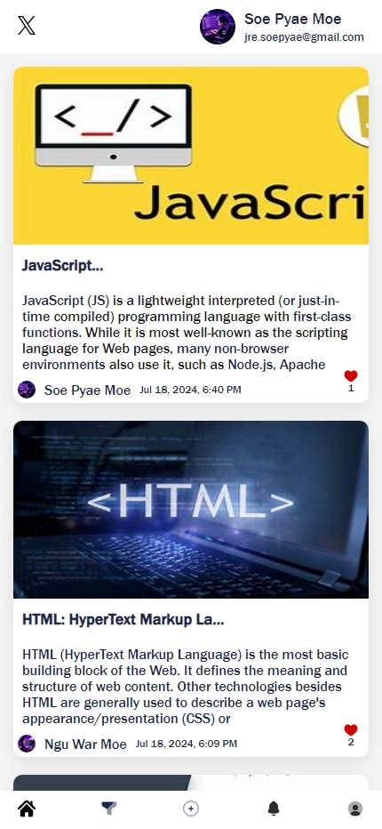
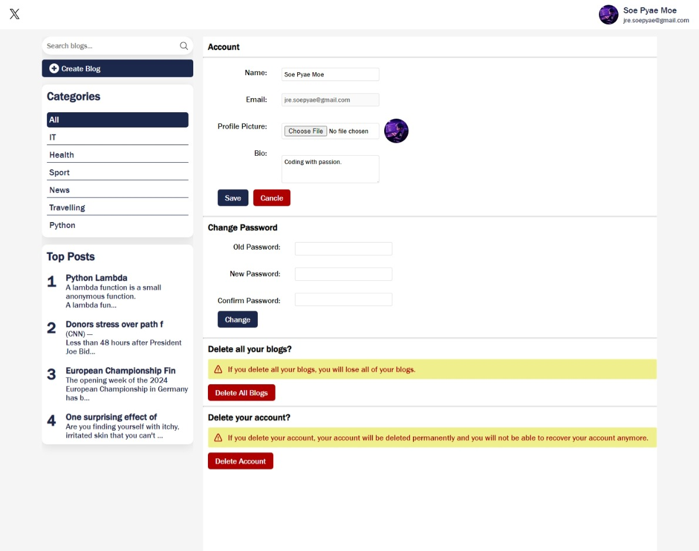
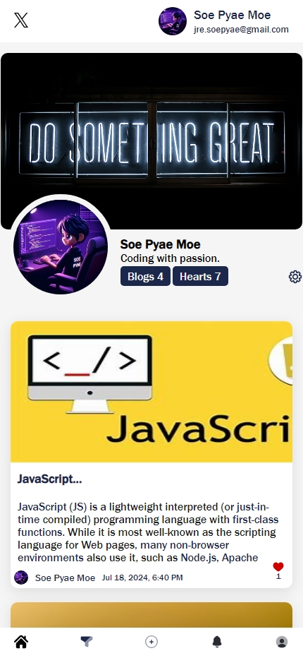
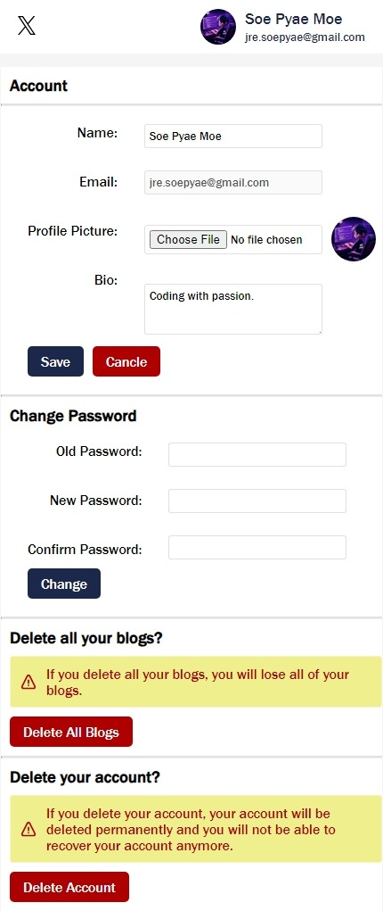
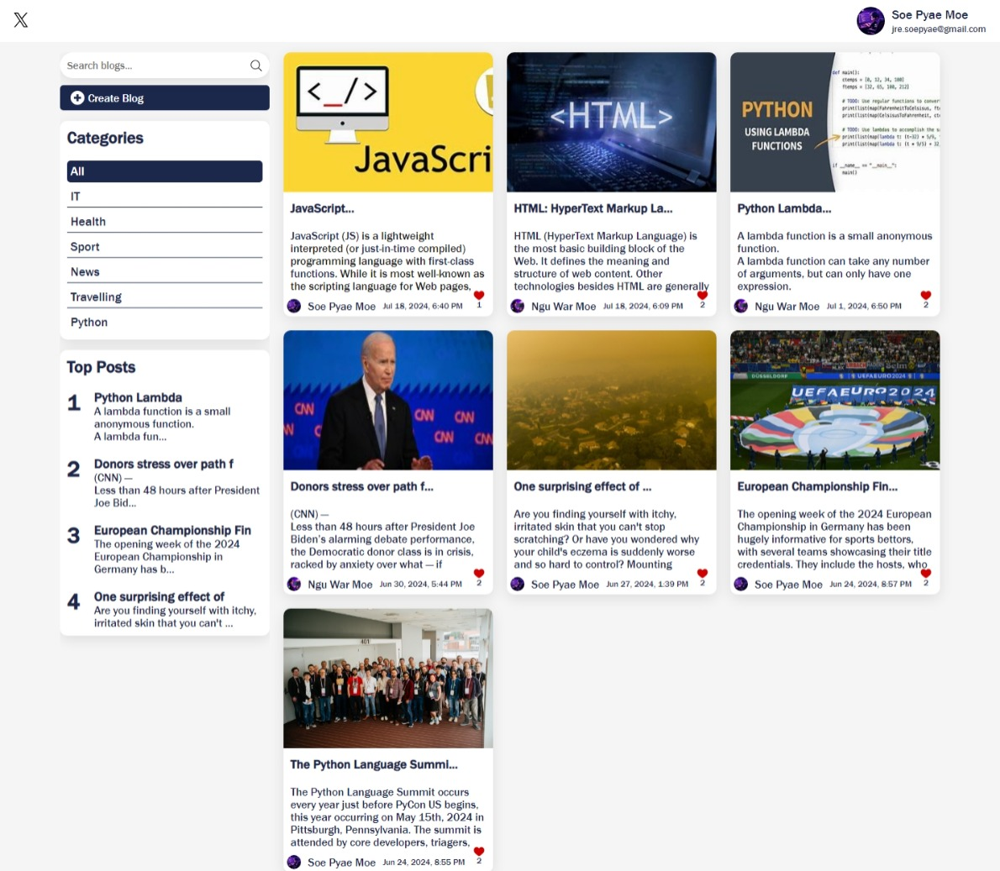
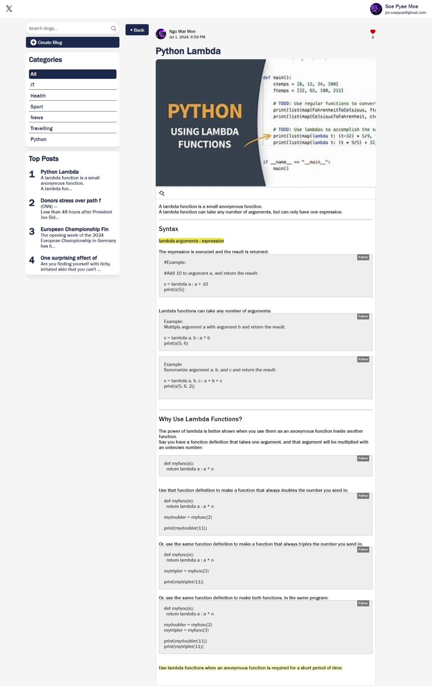
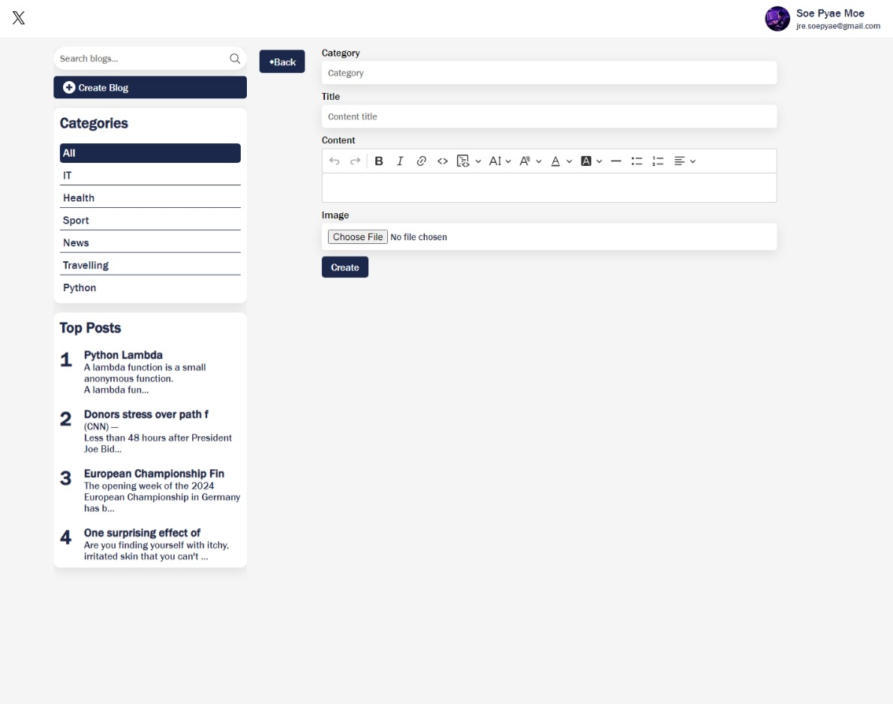

<div align="center">

# X backend
</div>

### Cloning the repository

--> Clone the repository using the command below :
```bash
git clone https://github.com/SoepyaeMoe/X.git

```

--> Move into the directory where we have the project files : 
```bash
cd X/backend

```

--> Create a virtual environment :
```bash
# Let's install virtualenv first
pip install virtualenv

# Then we create our virtual environment
virtualenv envname

```

--> Activate the virtual environment :
```bash
envname\scripts\activate

```

--> Install the requirements :
```bash
pip install -r requirements.txt

```

--> Make database migrations :
```bash
python manage.py makemigrations

```
--> Migrate table :
```bash
python manage.py migrate

```

#

### Running the App

--> To run the App, we use :
```bash
python manage.py runserver

```

> ⚠ Then, the development server will be started at http://127.0.0.1:8000/


# X forntend

--> Move into the directory where we have the project files : 
```bash
cd X/frontend

```

## Project setup
```
yarn install
```

```
npm install ckeditor5
```
### Compiles and hot-reloads for development
```
yarn serve
```
> ⚠ Then, the development server will be started at http://127.0.0.1:8080/

### Compiles and minifies for production
```
yarn build
```

### Lints and fixes files
```
yarn lint
```

### Customize configuration
See [Configuration Reference](https://cli.vuejs.org/config/).

### Demo photos






